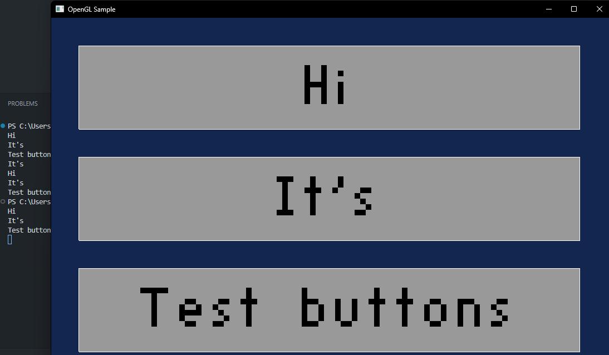

# 2D OpenGL Game

Краткое описание
- Небольшая 2D игра на OpenGL + Win32 (создание окна и ввод через WinAPI).
- Ресурсы: изображения в папке `src` (фон, персонаж, платформа и т.д.).
- Код структурирован: `main.c`, модули в `include/` и заголовки в `headers/`. В проекте также присутствуют заголовки stb в `stb-master/`.

Особенности
- Рендеринг через OpenGL (старый фиксированный функционал).
- Обработка столкновений и простое меню.
- Предназначена для Windows (Win32 API).

Требования
- Windows (поскольку используется windows.h / WinMain).
- MinGW-w64 / MSYS2 (gcc), dev-файлы OpenGL (opengl32, glu32) доступны для линковки.
- Папка `stb-master` рядом с исходниками (используются заголовки stb).

v1:
- 